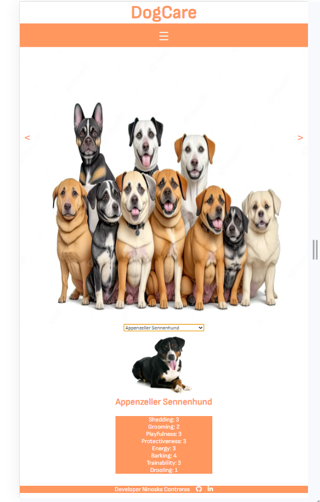

# DogCare 🐶

Project created with the objective of continuing to practice the creation of web pages with the Angular framework and also practice the consumption of an API.

DogCare is a website where you can see photos of dogs, organized by breed. In addition to the images, we offer some detailed information about each breed. 🦴🐕

If you want to enter the page please click this link: https://dog-care-f0esy5qky-niel0503.vercel.app/

## Developer

Ninoska Contreras

 
